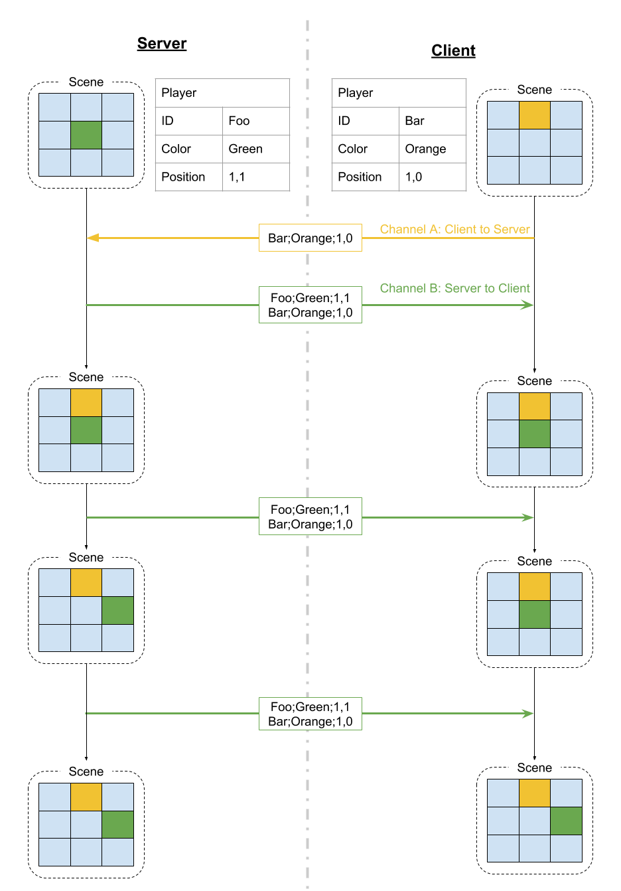
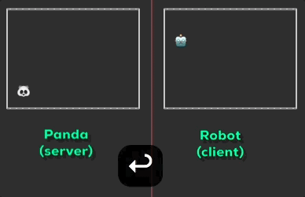

# Introduction

On tag [0.0.2a](../../tree/0.0.2a) basic version of the game was implemented. It contains the next components:

1. **Inputs**. A module to handle inputs from devices like keyboard or mouse. Currently, it supports only keyboard. It uses [termbox-go](https://github.com/nsf/termbox-go) library to catch keyboard events.
2. **Models**. Contains definitions of game objects. Currently, there are `Player` and `Scene` objects. The last one is basically a buffer to hold the information required to render frames from.
3. **Network**. The code to support multiplayer via the client-server architecture i.e. there should be a server started first and all other players shall connect to it.
4. **Renderers**. A module to render the scene. For now, it has only one renderer which is `console` renderer i.e. it draws the information from the `Scene` object to the terminals of the users.
5. **Core**. This is the code to tie all of those modules together, initiate everything required et centra. It leaves in `main.go` file for now.

The goal of this release is to prove a concept how to build 

**0.0.2a** release has two main goals. First one is to prove basic concepts:

* how to sync multiple players over the network;
* how will it look like in the terminal;
* how to organise the code, the build process etc;

Second is to provide a ground for further improvements. Because this is mostly an educational project for me (to have more practice with Go and game development at the same time) I plan to try different approaches for each module, analyse their pros and cons and see what will work better in my case.

For starter, I'd like to have a look at **Network** module.

## Network core

Currently, this is the most interesting part for the project for me. I sure learned a lot during its implementation and now have better understanding how it can be done and what needs to be improved. 

Let's look at the scheme to see how the current implementation works:

This implementation is far from ideal but it does work over lan network. The key problems here are:

* It requires 2 channels between server and client and currently those channels are **TCP**! (**TODO** explain more problems with it)
* Messages are in text format which is not very compact.
* The snapshots of the scene (Channel B) are full i.e. in case when nothing is happening the server will send exactly the same data over and over again wasting the bandwidth. Furthermore, at some point this might be so big amount of data that it will take visible amount of time to send it over.

All these decisions make it impossible to play the game through bad network connection. In the example below I have limited network speed to 10kbit/s and introduced a delay in 300ms (**TODO** explain how I did that):

As you can see, it is really easy to go out of sync. Mostly, this is because server constantly pushes its current state even though the client just sent an update.

#### Steps for improvement

1. Implement custom protocol over **UDP**. (**TODO** explain why it is better).
2. Pack the payload better e.g. via [MessagePack](https://msgpack.org/index.html) or the home-made one (maybe later).
3. Send only delta state of the scene.
